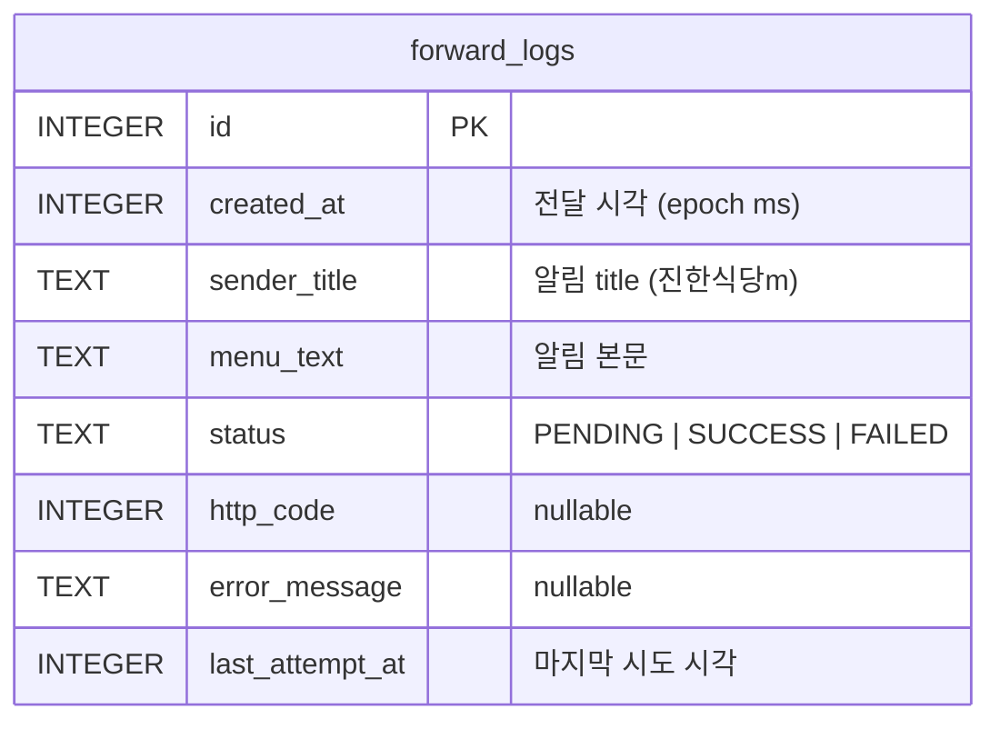

# KakaoTalk Notification Forwarder 구현

## Overview

카카오톡 앱의 알림 중 특정 발신자(기본값 "진한식당m")의 메시지를 감지하여 `slack-lunch-fairy` 서버의 `POST /api/menuPosts`로 자동 전달하는 Android 앱. 설정 화면과 포워딩 이력 화면을 탭으로 분리하며, 실패한 전송은 수동 재시도할 수 있다.

## Problem Statement / Motivation

`slack-lunch-fairy`는 외부에서 메뉴를 POST로 받아 구독 중인 슬랙 채널에 자동 게시하는 API를 갖추고 있지만, 현재 그 메뉴를 자동으로 수집하는 클라이언트가 없다. 카카오톡 단체방에서 매일 올라오는 식당 메뉴를 사람이 복붙하지 않고도 슬랙으로 흘려보내기 위해 Android의 `NotificationListenerService`를 활용해 알림을 가로채서 서버로 포워딩한다.

관련 브레인스톰: `docs/brainstorms/2026-03-30-kakaotalk-forwarder-brainstorm.md`

## Proposed Solution

- `NotificationListenerService`로 `com.kakao.talk` 패키지의 알림을 감지한다.
- 알림의 `android.title`이 설정된 닉네임과 정확히 일치하면 `android.text`(본문)를 추출해 API로 POST한다.
- 포워딩 결과(성공/실패, 에러 메시지, 요청 시각, 본문 등)를 Room DB에 저장해 History 탭에 시간 역순으로 보여준다.
- 실패 항목에는 재시도 버튼을 붙여 사용자가 탭하면 동일한 본문을 다시 전송하고, 성공 시 상태를 갱신한다.
- 설정값(API 엔드포인트 URL, Bearer 토큰, 필터 닉네임)은 DataStore Preferences에 저장하고, Service는 이 값을 매 알림 수신마다 `first()`로 읽어 사용한다.

## Technical Approach

### 아키텍처

```
┌─────────────────────┐
│ KakaoTalk 알림      │
└──────────┬──────────┘
           │ onNotificationPosted
           ▼
┌─────────────────────────────────────┐
│ ForwarderNotificationListener       │
│  (NotificationListenerService)      │
│  - 패키지/title 필터                │
│  - 설정값 로드 (DataStore)          │
│  - POST /api/menuPosts (OkHttp)     │
│  - 결과 기록 (Room)                 │
└──────────┬──────────────────────────┘
           │
           ▼
┌─────────────────────┐    ┌─────────────────────┐
│ ForwardingRepo      │◀──▶│ Room: ForwardLogDao │
│ (suspend API)       │    │ ForwardLog Entity   │
└──────────┬──────────┘    └─────────────────────┘
           │ Flow<List<ForwardLog>>
           ▼
┌─────────────────────────────────────┐
│ MainActivity (Compose)              │
│  ┌──────────────┐ ┌──────────────┐  │
│  │ Settings 탭  │ │ History 탭   │  │
│  └──────────────┘ └──────────────┘  │
└─────────────────────────────────────┘
```

### 패키지 구조

```
com.example.kakaotalkforwarder/
├── MainActivity.kt
├── KakaoTalkForwarderApp.kt          # Application 클래스 (DI 역할)
├── data/
│   ├── db/
│   │   ├── AppDatabase.kt
│   │   ├── ForwardLog.kt             # Entity
│   │   └── ForwardLogDao.kt
│   ├── prefs/
│   │   └── SettingsRepository.kt     # DataStore 래퍼
│   └── remote/
│       └── MenuPostsApi.kt           # OkHttp 호출부
├── service/
│   └── ForwarderNotificationListener.kt
├── ui/
│   ├── main/
│   │   ├── MainScreen.kt             # TabRow + HorizontalPager
│   │   └── MainViewModel.kt
│   ├── settings/
│   │   ├── SettingsScreen.kt
│   │   └── SettingsViewModel.kt
│   ├── history/
│   │   ├── HistoryScreen.kt
│   │   └── HistoryViewModel.kt
│   └── theme/                        # 기존
│       ├── Color.kt, Theme.kt, Type.kt
└── util/
    └── NotificationPermission.kt     # 권한 체크/이동 유틸
```

### 데이터 모델 (ERD)



- `status`는 `enum class ForwardStatus { PENDING, SUCCESS, FAILED }`로 정의하고 `TypeConverter`로 문자열 변환.
- 재시도해도 같은 row를 업데이트하므로 History UI는 1 항목 = 1 알림 기준을 유지한다.

### API 호출 규격

- **URL:** 사용자가 설정에 입력한 전체 엔드포인트 (예: `https://lunch.example.com/api/menuPosts`)
- **Method:** `POST`
- **Headers:**
  - `Authorization: Bearer {token}`
  - `Content-Type: application/json; charset=utf-8`
- **Body:**
  ```json
  { "menuText": "<알림 본문>", "source": "kakaotalk" }
  ```
- **성공 판정:** HTTP 2xx
- **실패 시 저장:** `http_code`, `error_message`(응답 body 앞부분 또는 예외 메시지)

### 주요 결정 사항과 근거

| 결정 | 선택 | 근거 |
|------|------|------|
| UI | Jetpack Compose + Material3 | 프로젝트에 이미 설정됨 |
| HTTP | OkHttp 5.3.0 + `executeAsync()` | 브레인스톰에서 결정, 코루틴 취소 연동 |
| DB | Room 2.8.4 (KSP) | Flow 지원, 코루틴 네이티브 |
| 설정 저장 | DataStore Preferences 1.2.1 | SharedPreferences 대체 권장, Flow |
| 매칭 방식 | `android.title`과 정확 일치 | 사용자 확인: 챗방 이름은 알림에 없고 발신자명이 title로 옴 |
| URL 입력 | 전체 엔드포인트 | 사용자 선택, 유연성 확보 |
| 이력 보관 | 무제한 + 전체 삭제 버튼 | 하루 1건 수준이라 용량 부담 적음 |
| 설정 미완료 처리 | 실패로 기록 | 놓치는 알림 없이 나중에 재시도 가능 |
| 중복 알림 | notification key 기반 단순 dedup | 같은 key의 업데이트는 첫 1회만 처리 |
| 재시도 | 무제한 수동 재시도, 실패 메시지 최신값으로 갱신 | UX 단순화 |
| HTTPS | https 전제, cleartext 허용 안 함 | 수신 서버가 리버스 프록시 뒤에 있어 앱 입장에서는 항상 https 엔드포인트 |

### 권한 및 매니페스트

`app/src/main/AndroidManifest.xml` 변경:

```xml
<uses-permission android:name="android.permission.INTERNET" />
<uses-permission android:name="android.permission.POST_NOTIFICATIONS" />

<application ...>
    <service
        android:name=".service.ForwarderNotificationListener"
        android:exported="true"
        android:label="@string/service_label"
        android:permission="android.permission.BIND_NOTIFICATION_LISTENER_SERVICE">
        <intent-filter>
            <action android:name="android.service.notification.NotificationListenerService" />
        </intent-filter>
    </service>
</application>
```

권한 유도:
- `NotificationManagerCompat.getEnabledListenerPackages(context).contains(packageName)`로 확인
- 미허용 시 `Settings.ACTION_NOTIFICATION_LISTENER_SETTINGS` 인텐트로 이동

### 의존성 추가 (version catalog)

`gradle/libs.versions.toml`에 추가:

```toml
[versions]
ksp = "2.2.10-2.0.2"
room = "2.8.4"
okhttp = "5.3.0"
coroutines = "1.10.2"
datastore = "1.2.1"
lifecycleViewModelCompose = "2.8.7"

[libraries]
room-runtime = { group = "androidx.room", name = "room-runtime", version.ref = "room" }
room-compiler = { group = "androidx.room", name = "room-compiler", version.ref = "room" }
room-ktx = { group = "androidx.room", name = "room-ktx", version.ref = "room" }
okhttp-bom = { group = "com.squareup.okhttp3", name = "okhttp-bom", version.ref = "okhttp" }
okhttp = { group = "com.squareup.okhttp3", name = "okhttp" }
okhttp-coroutines = { group = "com.squareup.okhttp3", name = "okhttp-coroutines" }
okhttp-logging = { group = "com.squareup.okhttp3", name = "logging-interceptor" }
kotlinx-coroutines-core = { group = "org.jetbrains.kotlinx", name = "kotlinx-coroutines-core", version.ref = "coroutines" }
kotlinx-coroutines-android = { group = "org.jetbrains.kotlinx", name = "kotlinx-coroutines-android", version.ref = "coroutines" }
datastore-preferences = { group = "androidx.datastore", name = "datastore-preferences", version.ref = "datastore" }
androidx-lifecycle-viewmodel-compose = { group = "androidx.lifecycle", name = "lifecycle-viewmodel-compose", version.ref = "lifecycleViewModelCompose" }

[plugins]
ksp = { id = "com.google.devtools.ksp", version.ref = "ksp" }
```

`app/build.gradle.kts`:

```kotlin
plugins {
    alias(libs.plugins.android.application)
    alias(libs.plugins.kotlin.compose)
    alias(libs.plugins.ksp)
}

dependencies {
    // 기존 compose/core/lifecycle 유지
    implementation(libs.room.runtime)
    implementation(libs.room.ktx)
    ksp(libs.room.compiler)

    implementation(platform(libs.okhttp.bom))
    implementation(libs.okhttp)
    implementation(libs.okhttp.coroutines)
    implementation(libs.okhttp.logging)

    implementation(libs.kotlinx.coroutines.android)
    implementation(libs.datastore.preferences)
    implementation(libs.androidx.lifecycle.viewmodel.compose)
}
```

### Implementation Phases

#### Phase 1: 기반 구조 + 의존성

- `libs.versions.toml` / `app/build.gradle.kts`에 의존성 추가
- `AndroidManifest.xml`에 권한, 서비스 선언 추가
- `KakaoTalkForwarderApp.kt` 생성(싱글톤 `AppDatabase`, `OkHttpClient`, `SettingsRepository` 보관)
- Room 3종(`ForwardLog`, `ForwardLogDao`, `AppDatabase`) 뼈대 작성
- `SettingsRepository`(DataStore) 작성

**완료 기준:** 앱이 크래시 없이 실행되고, 빈 화면이 뜨며, Room DB 파일이 생성된다.

#### Phase 2: NotificationListenerService + HTTP

- `ForwarderNotificationListener` 구현
  - `com.kakao.talk` 필터
  - `extras.getString(Notification.EXTRA_TITLE)` 추출 후 설정 닉네임과 정확 일치 비교
  - 설정 비어 있으면 `FAILED` + "설정 미완료"로 기록
  - 중복 방지: `sbn.key` 기준 최근 N초 내 동일 key는 스킵 (최소 5초)
- `MenuPostsApi` 구현: OkHttp `executeAsync()` + JSON 수동 직렬화 (`JSONObject`로 충분)
- `ForwardingRepository`: 서비스와 UI가 공유. `logPending()`, `markSuccess()`, `markFailed(code, msg)`, `retry(id)` 메서드 제공
- 첫 실행 시 `SettingsRepository.isConfigured()` 판정 로직

**완료 기준:** 실기기에서 카카오톡 테스트 방으로 메시지를 보내면 DB에 row가 쌓이고, 성공 시 서버 수신이 확인됨.

#### Phase 3: UI - Settings 탭

- `SettingsScreen`:
  - TextField 3개 (API URL, Bearer 토큰[마스킹+토글], 필터 닉네임)
  - 저장 버튼(명시적 저장, 잘못된 값 바로 반영 방지)
  - 알림 접근 권한 상태 카드: 허용됨/미허용 + "설정 열기" 버튼
  - `onResume` 시 권한 상태 재확인
  - "이력 전체 삭제" 버튼(확인 다이얼로그 포함)
- `SettingsViewModel`: `SettingsRepository` 주입, 현재 값 `StateFlow`로 노출

**완료 기준:** 설정 입력/저장이 가능하고, 재실행 후에도 값이 유지되며, 권한 상태 표시가 올바르게 동작한다.

#### Phase 4: UI - History 탭

- `HistoryScreen`:
  - `LazyColumn`으로 `Flow<List<ForwardLog>>` 표시 (최신순)
  - 각 항목: 시각(상대 시간), 상태 아이콘(✓/✗/⏳), 발신자, 본문 2줄 미리보기
  - 실패 항목: 에러 메시지 + 재시도 버튼(로딩 중에는 비활성화)
  - 항목 탭 시 BottomSheet로 전체 본문/에러 상세 보기
  - 리스트가 비어있을 때의 empty state
- `HistoryViewModel`: `retry(id: Long)` 구현 — 버튼 탭 시 상태를 `PENDING`으로 잠시 바꾸고 재전송 후 갱신

**완료 기준:** 실패로 기록된 항목을 재시도 버튼으로 성공시킬 수 있고, 상태가 즉시 갱신된다.

#### Phase 5: 통합 테스트 + 마무리

- 수신 대상은 사용자가 띄운 **Node.js 더미 서버**(리버스 프록시 뒤의 https 엔드포인트). 실제 slack-lunch-fairy는 중단 상태.
- 성공 판정은 "슬랙 채널 게시"가 아니라 **더미 서버 수신 로그에 `menuText`, `source`, `Authorization` 헤더가 정확히 찍히는지**로 확인.
- 실기기에서 end-to-end 시나리오 검증:
  1. 신규 설치 → 설정 입력 → 권한 부여 → 실제 알림 → 더미 서버 수신 로그 확인
  2. 네트워크 끊김 상태에서 알림 → 실패 기록 → 네트워크 복구 후 재시도 버튼으로 성공
  3. 더미 서버가 401/5xx 강제 응답 → 실패 메시지/상태코드 기록 확인 → 서버 정상화 후 재시도 성공
  4. 닉네임 불일치 알림은 DB에 남지 않는지 확인
  5. 동일 notification key 연속 포스팅 시 dedup 동작 확인
  6. 앱 강제종료 후 재실행 시 PENDING으로 남아있던 항목이 FAILED로 정리되는지 확인
- `strings.xml` 한글 문구 정리
- 앱 아이콘/이름 정리(기본값 유지 가능)

**완료 기준:** 위 5개 시나리오가 모두 통과한다.

## Alternative Approaches Considered

- **Ktor Client**: 프로젝트에 Kotlin Serialization을 추가로 끌고 들어와야 해서 단일 엔드포인트에는 과함. OkHttp + `JSONObject`로 충분.
- **자동 재시도 + WorkManager**: 브레인스톰 단계에서 "수동 재시도만" 결정됨. 배터리/구현 단순성 면에서 합리적.
- **Foreground Service로 영구 알림 표시**: `NotificationListenerService`는 시스템 서비스라 별도 Foreground Service가 필수는 아님. 사용자 요구사항이 아니므로 추가하지 않음.
- **SharedPreferences**: DataStore가 Flow 기반으로 Service/UI 간 실시간 반영에 적합하고 Google 권장이므로 DataStore 선택.
- **Room 3.0 알파**: 아직 안정 버전 아님. Room 2.8.4 사용.

## Acceptance Criteria

### 기능 요구사항

- [ ] 첫 실행 시 Settings 탭이 기본으로 열린다.
- [ ] API URL, Bearer 토큰, 필터 닉네임을 입력하고 저장할 수 있다. 닉네임 기본값은 "진한식당m".
- [ ] Bearer 토큰 필드는 마스킹되고, 토글로 표시/숨김 전환할 수 있다.
- [ ] 알림 접근 권한 상태가 화면에 표시되고, 버튼으로 시스템 설정 화면으로 이동할 수 있다.
- [ ] 앱 포그라운드 복귀 시 권한 상태가 자동으로 재확인된다.
- [ ] 카카오톡(`com.kakao.talk`) 알림 중 title이 필터 닉네임과 정확히 일치하면, 본문을 `menuText`로, `"kakaotalk"`을 `source`로 하여 설정된 URL에 Bearer 토큰과 함께 POST된다.
- [ ] 2xx 응답이면 이력이 SUCCESS로, 그 외에는 FAILED로 기록된다.
- [ ] 네트워크 예외(호스트 미해결, 타임아웃)도 FAILED로 기록되고 에러 메시지가 저장된다.
- [ ] 설정(URL 또는 토큰)이 비어있는 상태에서 매칭 알림이 오면 FAILED + "설정 미완료"로 기록된다.
- [ ] 동일 notification key의 알림 업데이트는 최근 5초 내 재수신 시 무시된다.
- [ ] History 탭에 이력이 최신순으로 표시되며, 각 항목에 시각·상태·발신자·본문 미리보기가 보인다.
- [ ] 실패 항목에 있는 재시도 버튼을 탭하면 같은 본문으로 POST가 재전송되고, 성공 시 상태가 SUCCESS로 갱신된다.
- [ ] 재시도 중에는 재시도 버튼이 비활성화된다.
- [ ] 항목을 탭하면 전체 본문과 에러 메시지를 볼 수 있는 상세 UI가 열린다.
- [ ] 설정 화면의 "이력 전체 삭제" 버튼으로 확인 다이얼로그 후 전체 이력을 지울 수 있다.

### 비기능 요구사항

- [ ] OkHttp 타임아웃은 connect 10s, read 15s, write 15s로 설정.
- [ ] `NotificationListenerService`에서 발생한 예외는 서비스 전체를 죽이지 않는다(try/catch 경계 명확).
- [ ] Bearer 토큰은 로그에 남지 않는다.
- [ ] minSdk 24부터 정상 동작한다.

### 품질 게이트

- [ ] `./gradlew assembleDebug` 성공
- [ ] 실기기에서 Phase 5의 5개 시나리오 수동 검증 통과

## Dependencies & Risks

- **카카오톡 알림 구조의 가정**: 사용자가 "title이 사용자명으로 온다"고 확인했지만, 카카오톡 버전/OS 버전에 따라 달라질 수 있다. Phase 2 초반에 실기기 로그로 반드시 검증.
- **배터리 최적화/제조사 killer**: Samsung, Xiaomi 등에서 서비스가 죽을 수 있음. 이번 버전에서는 안내 문구 없이 진행하고, 실사용 후 문제 시 추가.
- **Android 13+ POST_NOTIFICATIONS**: 현재는 앱 자체가 알림을 쏘지 않으므로 필수는 아니지만, 매니페스트에 선언만 해둠(향후 상태 알림 확장 시 즉시 사용 가능).
- **HTTPS 전제**: 수신 서버가 리버스 프록시 뒤에 있어 앱은 항상 https 엔드포인트를 사용. 별도 cleartext 설정 불필요.

## Success Metrics

- 설정 후 24시간 내 실제 카카오톡 알림이 슬랙 채널에 게시됨이 확인되어야 한다.
- 네트워크 단절 상황에서의 실패 → 재시도 흐름이 수동 조작으로 성공해야 한다.

## References & Research

### 내부 참조

- 브레인스톰: `docs/brainstorms/2026-03-30-kakaotalk-forwarder-brainstorm.md`
- 서버 API 구현: `~/Projects/slack-lunch-fairy/src/api/index.ts`
- 서버 스키마: `~/Projects/slack-lunch-fairy/src/db/schema.ts`
- 기존 Compose 테마: `app/src/main/java/com/example/kakaotalkforwarder/ui/theme/Theme.kt`

### 외부 참조

- [Room 2.8 Release Notes](https://developer.android.com/jetpack/androidx/releases/room)
- [OkHttp coroutines 모듈](https://github.com/square/okhttp/blob/master/okhttp-coroutines/README.md)
- [DataStore Preferences 가이드](https://developer.android.com/topic/libraries/architecture/datastore)
- [NotificationListenerService 레퍼런스](https://developer.android.com/reference/android/service/notification/NotificationListenerService)
